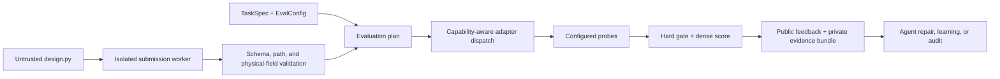

# Architecture

`mech-sim` is a verifier and control plane for agent-generated mechanical
designs. Mechanism knowledge lives in versioned task data; the runtime provides
generic execution, validation, simulation dispatch, probes, scoring, feedback,
and evidence packaging.

## Design principle

A conventional mechanism-specific harness embeds the question “what should be
checked?” in validator code. `mech-sim` instead separates:

```text
task requirements + evaluation configuration
                    ↓
generic evaluator → capability plan → adapters → probes → evidence
```

Adding a mechanism family usually means adding a generator, task contract,
reference solution, and negative controls. Runtime code changes only when the
new family needs a genuinely new universal capability or probe.

## End-to-end flow



Cheap checks run before expensive ones where possible. A missing capability is
reported explicitly; it is never replaced silently by synthetic data.

## Core contracts

### `DesignIR`

An agent submission exposes:

```python
def build_design(out_dir: Path) -> dict:
    ...
```

The result describes parts, joints, ports, parameters, and optional geometry,
material, tolerance, contact, actuator, load-case, and manufacturing metadata.
The worker requires JSON-serializable output and rejects non-finite or
structurally invalid values.

Geometry references must resolve under the trusted build directory. The
validator rejects absolute escapes, traversal, unsafe identifiers, and symlink
escapes. Mass properties are checked for physical consistency; CAD-backed tasks
can additionally require trusted-side recomputation.

### `TaskSpec` and `EvalConfig`

Each task separates the functional request from evaluation policy:

- `task.toml` defines ports, mobility, envelope, objectives, fixtures, and
  other task requirements.
- `eval_config.toml` selects probes, weights, hard gates, adapter settings, and
  metric visibility.
- `eval_config.public.toml` and `eval_config.hidden.toml` can apply different
  thresholds or checks without changing the task prompt.

This separation supports training feedback, hidden evaluation, and alternate
cost/credibility modes over the same artifact.

### Probes

A probe consumes the validated design, adapter outputs, and probe
configuration, then emits pass state, metrics, failures, and artifact links.
Each probe declares the capabilities it requires.

| Probe | Primary purpose |
|---|---|
| `analytic_param_check` | Compare a derived or declared value with a configured relation |
| `contact_engagement` | Require a named contact pair to carry force for enough of a trial |
| `dof_grubler` | Check planar or spatial mobility from topology |
| `lockup` | Detect output immobility under prescribed input motion |
| `path_trace_chamfer` | Compare a simulated path with a target trace |
| `port_velocity_ratio` | Measure input/output velocity relationship |
| `printability_dfam` | Check supplied mesh/manufacturing metrics |
| `required_ports` | Enforce interface presence, type, and grounding |
| `safety_factor` | Evaluate solver-provided structural safety-factor results |
| `swept_collision` | Bound unwanted overlap during a motion sweep |
| `torque_load_trial` | Evaluate motion, torque ripple, and power balance under load |
| `trusted_asset_preflight` | Require trusted geometry, material, and mass evidence |

Probes are generic. Family-specific behavior belongs in task configuration and
fixtures unless it expresses a reusable physical check.

### Adapters

Adapters advertise a capability set and cost tier. The evaluator selects the
lowest-cost eligible adapter for each plan.

| Adapter | State | Role |
|---|---|---|
| `planar_kinematics` | Always available | Deterministic planar positions, paths, velocities, and mobility support |
| `chrono_contact` | Optional native runtime | Rigid-body dynamics, joints, motors, loads, contact, collision, and traces |
| `fake_contact_oracle` | Explicit opt-in only | Deterministic synthetic outputs for pipeline and policy tests |

The native adapter registers only when a compatible Project Chrono runtime is
available. The synthetic adapter carries `oracle_is_synthetic=true` through
the final report. See the [backend reference](docs/chrono-backend.md).

### Feedback and evidence

Failures use a closed code vocabulary rather than requiring a learning system
to parse prose. A failure contains severity, observed and target values,
location, public repair hint, and an optional private trace reference.

Public serialization respects metric visibility and removes private traces.
Full run bundles can contain:

- public and trusted JSON reports;
- task, design, geometry, and configuration digests;
- per-adapter HDF5 traces;
- static dashboard data and optional media; and
- native solver and trusted-asset metadata.

## Scoring and reward

Scoring separates validity from optimization:

```text
reward = 0                         if evaluation is invalid
reward = 0                         if a hard gate fails
reward = weighted probe score     otherwise, bounded to [0, 1]
```

Failed probes may still expose public diagnostics and progress metrics. This
lets an agent repair a design without receiving positive reward for an invalid
artifact.

The compact RLVR API returns the gated reward, dense score, public feedback,
retry suggestions, scalar channels, run identity, and synthetic-evidence flag.
Training code does not need access to hidden evaluation details.

## Evaluation modes

- `fast` uses the inexpensive subset of configured checks.
- `oracle` requests the more expensive configured capabilities.
- `final` evaluates both paths and records agreement and final policy.
- The default mode follows the task’s selected evaluation configuration.

Modes are evaluation policies, not evidence labels. A fast analytic result can
be trustworthy for its narrow claim; a native solver result can still be
unvalidated.

## Procedural benchmark

The generator registry currently contains 58 families:

| Tier | Families | Typical dependency |
|---|---:|---|
| `artifact_static` | 13 | No simulator |
| `planar_kinematics` | 16 | Analytic planar adapter |
| `transmission_analytic` | 14 | No simulator or analytic motion |
| `contact_dynamics` | 15 | Explicit synthetic test adapter or native Chrono |

A generated task directory contains the prompt, task and evaluation contracts,
public/hidden variants, fixtures, a reference solution, negative solutions,
expected failures, and metadata. The repository currently checks in an older
51-task materialization; the registry count and frozen evidence count should
not be conflated.

## Trust boundaries

The evaluator assumes an agent may produce malformed, misleading, or hostile
output. The implementation therefore:

- executes submissions in a child process with a timeout;
- validates before probes and simulation;
- confines referenced geometry to the build root;
- distinguishes declared properties from trusted recomputation;
- keeps hidden thresholds and private traces out of public reports;
- requires explicit synthetic-adapter opt-in; and
- blocks reward when evaluation validity or a hard gate fails.

This is application-level isolation, not a complete operating-system sandbox.
Production deployment should add container or process-level resource and
network controls appropriate to the threat model.

## Deliberate boundaries

The runtime is not:

- a CAD kernel;
- a general FEA solver;
- a hardware-calibrated digital twin;
- a guarantee that every generated task is physically rich; or
- a substitute for model-specific verification and validation.

The project uses external geometry and physics engines behind adapters while
keeping task contracts, trust labels, evidence, and learning feedback stable.
The [project status](docs/project-status.md) records current implementation and
results; the [simulation roadmap](docs/high-fidelity-simulation-roadmap.md)
defines the work required for stronger predictive claims.
