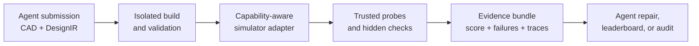

# mech-sim

### Verifiable simulation for autonomous manufacturing agents

[](https://github.com/cybernetic-physics/mech_sim/actions/workflows/core-ci.yml)

`mech-sim` is an open research platform for asking an autonomous agent to
design a mechanism, running that design through trusted checks and simulation,
and returning structured evidence instead of a subjective score.

The repository is built around `mech-bench`, a mechanical-design benchmark and
evaluation runtime. It provides the missing verification layer between an
agent-generated CAD or mechanism submission and a credible result: isolated
submission execution, explicit task contracts, capability-aware simulation,
hard safety gates, dense feedback, and replayable evidence bundles.

The long-term goal is to train agents that can turn functional requirements
into manufacturable, validated robotics parts. See the
[autonomous manufacturing research vision](docs/autonomous-manufacturing-vision.md)
for the learning loop, curriculum, evaluation strategy, and path to physical
production.

> **Research status:** the evaluator, task system, analytic adapters, trusted
> asset checks, PyChrono integration, and verifier-guided learning machinery
> are implemented. The platform is not yet a hardware-calibrated digital twin,
> and synthetic test output is always labeled as synthetic. See the
> [current project status](docs/project-status.md) for executed evidence and
> known limitations.

## Motivation

Verifiable simulation for autonomous manufacturing agents is the core idea:
the agent can propose and iterate freely, while a separate evidence layer
decides what is safe, reproducible, and physically credible. Autonomous
fabrication needs more than a physics sandbox. It needs a way to answer,
repeatably:

- Did the submitted artifact satisfy the task contract?
- Which claims came from trusted geometry and which were agent-declared?
- Was a result analytic, synthetic, or produced by a physical simulator?
- Can another team replay the run from the same inputs and solver settings?
- Can a verifier return useful repair feedback without exposing hidden tests?

`mech-sim` treats those questions as first-class system requirements. The same
contract supports benchmark evaluation, verifier-guided agent repair, and
eventual multi-agent manufacturing challenges.

## What works today

| Capability | Current state |
|---|---|
| Task and submission contracts | `DesignIR`, `TaskSpec`, `EvalConfig`, public/hidden splits, and 58 procedural mechanism families |
| Trusted evaluation | Isolated submission execution, schema/path validation, hard gates, dense scoring, and a closed failure-code grammar |
| Fast mechanics | Analytic topology, kinematics, transmission, clearance, and manufacturability probes |
| Physical simulation | Optional PyChrono runner with bodies, joints, motors, loads, collision geometry, NSC/SMC contact, traces, and solver diagnostics |
| CAD evidence | STEP/mesh fixtures, trusted-asset manifests, recomputed mass-property paths, and provenance checks |
| Agent learning | Compact RLVR reward API, public feedback, retry suggestions, and verifier-gated training/evaluation scripts |
| Reproducibility | JSON scorecards, HDF5 traces, manifests, dashboards, media, and content-addressable evidence fields |

The strongest checked-in results are deliberately scoped:

- a frozen 51-task snapshot with **50/51 reference controls passing** and
  **104/104 expected negative failures detected**;
- a real CAD-to-Chrono geometry-path proof; and
- a matched-budget Level-1 experiment in which online verifier-derived
  adaptation improved held-out-family mechanism-program repair by **62.5
  percentage points** over its no-update baseline.

The first snapshot includes synthetic contact tasks, the geometry proof is not
hardware calibration, and the learning result does not cover CAD or contact
physics. The [evidence ledger](docs/project-status.md#evidence-ledger) keeps
those boundaries explicit.

## Five-minute tour

Requires Python 3.11+ and [`uv`](https://docs.astral.sh/uv/).

```bash
uv sync --extra dev

# Inspect the available probes and simulator adapters.
uv run mech-bench list-probes
uv run mech-bench list-adapters

# Evaluate a known reference mechanism.
uv run mech-bench evaluate \
  --task tasks/fourbar_path_t001 \
  --submission tasks/fourbar_path_t001/reference_solution

# Check whether the native Chrono stack is available on this machine.
uv run mech-bench chrono-diagnostic
```

For a portable development check that does not require a GPU, PyChrono, or
archived experiment infrastructure:

```bash
scripts/check_core.sh
```

To provision and exercise the native solver stack:

```bash
scripts/solver_smoke.sh
```

## System model



The evaluator never assumes that every task needs the same simulator. Cheap
analytic checks run first; a task requests physical capabilities only when it
needs them. A synthetic adapter is available for pipeline tests, but it must be
enabled explicitly and its reports carry `oracle_is_synthetic=true`.

The architectural details and trust boundaries are documented in
[`ARCHITECTURE.md`](ARCHITECTURE.md).

## Research direction

The core research bet is that verifiable simulation can become a reinforcement
learning environment for autonomous manufacturing. An agent repeatedly:

1. receives a functional requirement for a robotics part;
2. generates CAD, mechanism structure, materials, and process choices;
3. receives trusted geometric and physical feedback;
4. repairs the design within a bounded attempt budget; and
5. learns from the resulting trajectory rather than a text-only preference.

The intended curriculum grows from valid artifacts and simple mechanisms to
contact-rich assemblies, manufacturability, resource constraints, and paired
virtual/physical trials. Brackets, transmissions, grippers, fixtures, and
replacement components provide measurable tasks with direct robotics value.

The [research vision](docs/autonomous-manufacturing-vision.md) describes how the
current verifier and RLVR stack develops into agents that can design and make
useful parts autonomously.

## Repository map

| Path | Purpose |
|---|---|
| `mech_bench/` | Evaluator, schemas, probes, adapters, evidence, and CLI |
| `tasks/` | Versioned reference tasks, solutions, and negative controls |
| `rl/` | Agent-loop, RLVR, SFT, and GRPO integration |
| `scripts/` | Benchmark generation, experiment, audit, and solver tooling |
| `docs/` | Evidence, design decisions, results, and simulation roadmap |
| `runs/` | Frozen experiment manifests and selected reproducibility artifacts |
| `tests/` | Unit, integration, native-solver, and experiment-replay checks |

## Documentation

- [Documentation index](docs/README.md)
- [Current project status and evidence ledger](docs/project-status.md)
- [Autonomous manufacturing research vision](docs/autonomous-manufacturing-vision.md)
- [Architecture and trust boundaries](ARCHITECTURE.md)
- [Chrono backend](docs/chrono-backend.md)
- [High-fidelity simulation roadmap](docs/high-fidelity-simulation-roadmap.md)
- [Contributing and validation tiers](CONTRIBUTING.md)

## Claim boundaries

The project deliberately distinguishes four evidence levels:

| Evidence level | Meaning |
|---|---|
| Analytic | Deterministic topology, geometry, or closed-form mechanics |
| Synthetic | Pipeline test data; never presented as physical evidence |
| Simulated | Produced by an identified solver with recorded settings |
| Validated | Compared with a trusted physical or independent reference dataset |

Current results include analytic, synthetic, and simulated evidence. Broad
hardware validation remains roadmap work. This distinction is enforced in
report metadata and is part of the project’s trust model, not a documentation
disclaimer.

## Development

```bash
uv sync --extra dev
scripts/check_core.sh
```

Optional training stacks are installed separately:

```bash
uv sync --extra training-mlx
# or
uv sync --extra training-grpo
```

See [`CONTRIBUTING.md`](CONTRIBUTING.md) before changing evaluator semantics,
trust labels, task contracts, or frozen evidence.
