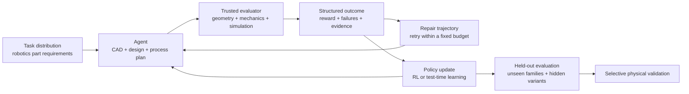

# Verifiable Simulation for Autonomous Manufacturing Agents

## The vision

Robotic systems should eventually be able to design and manufacture the
mechanical parts they need.

An agent should be able to receive a functional requirement—hold this sensor,
transmit this torque, move this payload, replace this failed linkage—and produce
a part that is geometrically valid, physically credible, manufacturable, and
supported by evidence. When the first design fails, the agent should diagnose
the failure, repair the design, and improve from the full trajectory.

`mech-sim` is building the learning environment for that capability. The
central idea is to combine reinforcement learning with trusted mechanical
verification so agents learn from the consequences of the artifacts they
create, not only from text demonstrations or human preferences.

The project sits between two active lines of work. Systems such as
[Text2CAD](https://arxiv.org/abs/2409.17106) show that models can generate
parametric CAD sequences from language. Work such as
[DeepSeekMath](https://arxiv.org/abs/2402.03300) shows how objective,
automatically checked outcomes can support reinforcement learning. Mechanical
design needs both ideas plus a stricter evidence boundary: an executable model
or visually plausible shape is only the beginning, and the reward must reflect
geometry, interfaces, mechanics, manufacturability, and uncertainty.

## Why reinforcement learning

Autonomous manufacturing is a long-horizon problem. A successful result may
require many dependent decisions:

- interpret an underspecified functional requirement;
- choose a mechanism and topology;
- generate valid CAD and interfaces;
- select materials, tolerances, and manufacturing processes;
- predict kinematic and dynamic behavior;
- diagnose failed constraints or simulation results;
- revise the design without breaking previously satisfied requirements; and
- stop when the evidence is strong enough to manufacture.

These decisions interact. A locally plausible choice can make the final
assembly impossible, unsafe, or expensive. Static imitation data captures
examples of good outputs, but it does not teach an agent how to recover from
its own mistakes.

Reinforcement learning supplies the missing closed loop. The agent explores,
receives structured feedback from a trusted evaluator, repairs its artifact,
and updates toward strategies that succeed across task families and hidden
variants.

## Why robotics parts

Mechanical parts for robotics are a useful training domain because success is
measurable and consequential. A bracket fits or it does not. A transmission
reaches its ratio or it does not. A gripper retains a payload or it does not.
A linkage follows the required path or it does not.

The domain also offers a natural curriculum:

1. **Artifact validity** — produce parseable, isolated, unit-consistent CAD and
   structured design data.
2. **Interfaces and topology** — satisfy ports, mounting patterns, mobility,
   envelopes, and assembly constraints.
3. **Functional mechanics** — achieve motion paths, ratios, forces, clearances,
   and load requirements.
4. **Physics-aware design** — reason about contact, collision, torque, energy,
   stress, and failure.
5. **Manufacturability** — account for process limits, material, tolerances,
   machine time, and cost.
6. **Closed-loop production** — connect virtual evidence to fabrication,
   inspection, physical testing, and repair.

Each level produces artifacts that can be checked automatically, making it
possible to train at scale while reserving expensive simulation and physical
trials for the decisions that need them.

## The learning loop

The verifier is deliberately separate from the policy. Agent-generated code,
CAD, paths, mass properties, and claimed performance are untrusted inputs.
Trusted-side checks recompute what they can, run the appropriate simulator,
and return a compact outcome with hard failures, dense metrics, and repair
suggestions.

This separation makes the environment useful for both training and evaluation.
The same agent can improve, while the hidden task contract and trusted evidence
boundary remain fixed.

## What `mech-sim` provides today

- `DesignIR`, `TaskSpec`, and `EvalConfig` contracts for mechanical tasks.
- Isolated execution and validation of agent-generated submissions.
- Public feedback with separate hidden evaluation configurations.
- A capability-aware evaluator that selects analytic or physics adapters.
- Hard validity gates, dense reward channels, and structured failure codes.
- Fifty-eight procedural mechanism families spanning static artifacts,
  kinematics, transmissions, and contact dynamics.
- An optional PyChrono path for rigid-body and contact simulation.
- Trusted CAD-asset, geometry, mass-property, and provenance checks.
- RLVR, supervised fine-tuning, GRPO, and online verifier-feedback tooling.
- Replayable scorecards, traces, manifests, dashboards, and media.

This is enough to study verifier-guided design and repair. It is not yet a
general autonomous factory or a broadly hardware-validated digital twin.
The [project status](project-status.md) separates implemented capability,
executed evidence, and unfinished work.

## Research questions

The project is designed to answer concrete questions:

1. Can verifier-gated online learning outperform a frozen agent given the same
   inference and simulation budget?
2. Do repair skills learned on one mechanism family transfer to unseen
   families and hidden perturbations?
3. Which feedback is most useful: failure codes, continuous metrics, traces,
   rendered evidence, or counterexamples?
4. How should cheap analytic checks and expensive physics simulation be
   scheduled during training?
5. Can an agent learn to avoid reward exploits when public and hidden checks
   differ?
6. Which virtual metrics predict successful fabrication and physical testing?
7. When do specialized design, simulation, and manufacturing policies
   outperform one general policy?

## Evaluation

Progress should be measured on held-out tasks, not by the visual quality of a
single demonstration.

| Metric | What it measures |
|---|---|
| First-pass validity | Whether the agent produces a usable artifact without repair |
| Verified success at fixed budget | End-to-end success under equal attempts, tokens, and solver calls |
| Repair efficiency | How quickly the agent converts specific failures into a passing design |
| Hidden-variant success | Resistance to overfitting and verifier gaming |
| Cross-family transfer | Generalization to mechanisms absent from training |
| Physics credibility | Agreement, convergence, and diagnostic quality for simulated results |
| Manufacturing efficiency | Material, machine time, part count, cost, and assembly complexity |
| Physical transfer | Agreement between predicted and measured behavior |

Every reported result should identify whether its evidence is analytic,
synthetic, simulated, or physically validated.

## Roadmap

### 1. Reliable mechanical verifier

Make artifact validity, geometry, interfaces, mechanism behavior, and evidence
packaging dependable enough to serve as a training signal.

### 2. Agents that learn from repair

Train policies on complete design–evaluate–repair trajectories. Compare frozen
agents, search-only baselines, supervised policies, online RL, and test-time
learning under equal budgets.

### 3. Robotics-part curriculum

Expand from benchmark mechanisms to useful brackets, grippers, transmissions,
fixtures, end-effectors, sensor mounts, and replacement components with
explicit manufacturing constraints.

### 4. Manufacturing process model

Add material inventory, machine capabilities, operation sequencing, tolerances,
inspection, time, and cost so agents optimize the full route from requirement
to finished part.

### 5. Physical feedback

Pair selected virtual tasks with fabricated parts, metrology, and robot tests.
Use discrepancies to calibrate simulators, refine task distributions, and train
agents to reason about uncertainty and process variation.

### 6. Autonomous part production

Close the loop so a robotic system can identify a mechanical need, design a
part, assemble evidence, choose a process, manufacture it, inspect it, and learn
from the physical outcome.

## End state

The end state is not an agent that produces attractive CAD screenshots. It is
an agent that can create useful robotics hardware with a defensible chain of
evidence.

For every part, the system should be able to answer:

- What requirement was the part designed to satisfy?
- Which alternatives did the agent try, and why did they fail?
- Which properties were recomputed on the trusted side?
- Which claims came from analysis, simulation, or physical measurement?
- Can the design and evaluation be replayed?
- What uncertainty remains before the part is used?

That evidence-centered learning loop is the path from mechanical-design agents
to autonomous manufacturing agents.
